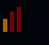
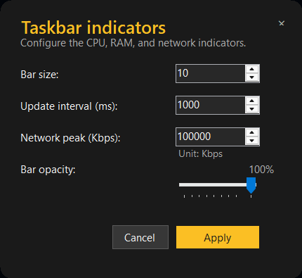
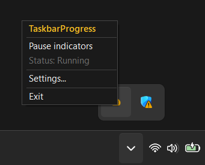
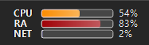
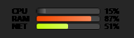
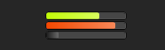

# MetricForge

<p align="center">
  
</p>

<h3 align="center">A lightweight Windows taskbar monitor for CPU, RAM, and network activity.</h3>

<p align="center">
  
  
  
</p>

> Keep an eye on your system at a glance. MetricForge displays compact, color-coded CPU, memory, and network indicators just above the Windows taskbar.

## Preview

<!-- Add your screenshots to docs/screenshots/ using the filenames below. -->

<p align="center">
  
</p>

<p align="center">
  
</p>

<p align="center">
  
</p>

<p align="center">
  
  
</p>

<p align="center">
  
</p>

## Highlights

- Three compact horizontal indicators for CPU, RAM, and network activity.
- Smooth animated usage bars with configurable opacity.
- Automatic, light, or dark contrast theme.
- Optional CPU/RAM/NET labels and percentage values.
- Customizable low, medium, and high threshold colors.
- Configurable update interval and bar thickness.
- Configurable network peak speed for accurate network scaling. (Recommended)
- Runs quietly from the Windows system tray.
- Click-through overlay positioned over the taskbar.
- No administrator privileges required.

## Download and use MetricForge

You do not need to install an IDE, .NET, or any programming tools to use MetricForge.

### For users

1. Download the latest `MetricForge-win-x64.zip` file from the [Releases](https://github.com/ZahaSanko001/MetricForge/releases) page.
2. Right-click the ZIP file and choose **Extract All**.
3. Open the extracted folder and double-click `MetricForge.exe`.
4. MetricForge will start in the Windows system tray. Look for its icon near the clock.
5. Right-click the tray icon to pause the indicators, open **Settings...**, or exit the app.

### Overlay behavior

- Clicking the Windows Start menu can temporarily hide the overlay. Click anywhere outside the taskbar to close the Start menu and make the overlay appear again.
- Clicking the taskbar can temporarily hide the overlay. It will automatically reappear after the taskbar finishes updating.
- The overlay is click-through, so it does not block normal taskbar or desktop interaction.
- These behaviors cost negligent CPU and RAM. 

Do not run the executable directly from inside the ZIP file. Extract the ZIP first.

On the first launch, Windows may show a SmartScreen warning because the application is not code-signed. If you downloaded it from the official project release, select **More info** and then **Run anyway**.

## Requirements

- Windows 10 or later for the self-contained release.
- .NET 10 Desktop Runtime only when using the framework-dependent package.
- .NET 10 SDK only when building from source.

## Running from source

```powershell
git clone https://github.com/ZahaSanko001/MetricForge.git
cd MetricForge
dotnet run
```

The application starts in the system tray. Right-click the tray icon to pause/resume indicators, open Settings, or exit.

## Settings

Open **Settings...** from the tray menu to configure:

| Setting | Description |
| --- | --- |
| Bar size | Controls the thickness of each horizontal indicator. |
| Bar opacity | Controls the translucency of the colored bars. |
| Update interval | Controls how often system values are refreshed. |
| Network peak | The connection peak in Kbps used to scale the network indicator. |
| Contrast theme | Automatically follows Windows, or uses Light/Dark styling. |
| Show labels | Toggles the CPU, RAM, and NET labels. Enabled by default. |
| Show percentages | Toggles the percentage values. Enabled by default. |
| Threshold colors | Lets you customize the low, medium, and high usage colors. |

For example:

```text
100 Mbps = 100000 Kbps
1 Gbps   = 1000000 Kbps
```

## Overlay screenshot placeholders

Add the following images to `docs/screenshots/` when you are ready:

```text
taskbar-indicators.png
settings.png
tray-menu.png
overlay-dark-mode.png
overlay-light-mode.png
labels-and-percentages.png
no-labels-no-percentages.png
labels-only.png
percentages-only.png
demo.gif
```
## Project structure

```text
Core/                    Application models, interfaces, and orchestration
Infrastructure/          Windows metrics collectors and taskbar overlay renderer
Presentation/            Tray application, settings UI, and icon resources
Program.cs               Dependency injection and application startup
```
## Contributing

Issues, suggestions, and pull requests are welcome. Please include your Windows version, .NET version, and reproduction steps when reporting a problem.

## License

This project is licensed under the MIT License. See the [LICENSE](LICENSE) file for details.
